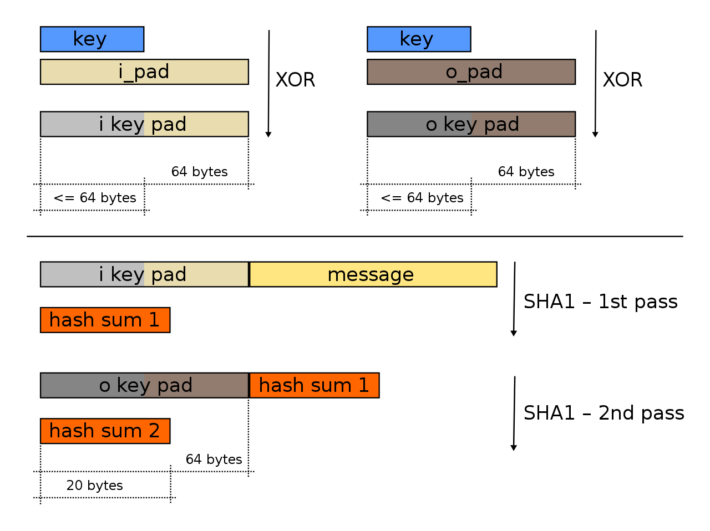

# HMAC - keyed hashed message authentication code
ref: RFC 2104

HMAC requires two things to calculate mac of a message
1. cryptographic hash function like SHA1 ,2, 3
2. a pseudo random secret key

The secret key is first used to derive two keys – inner and outer keys.

HMAC uses two passes of hash computation. The first pass of the algorithm produces an internal hash derived from the message and the inner key. The second pass produces the final HMAC code derived from the inner hash result and the outer key.